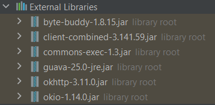

<h2> TheSeleniumTest - https://www.thesparksfoundationsingapore.org/ </h2>

<h3> Graduate Rotational Internship Program ||
The Sparks Foundation </h3>

  </>

<h4> <b>Web & Mobile Development Task #6 </b> </h4>

 <h5> <ul>Testing (Automated)<ul/>

<li> Read up about Testing. </>
<li> Learn selenium and basic selenium automation scripting. </>
<li> Start with Google Search and read tutorials. Watch videos to learn about various aspects of testing using selenium. </>
<li> Use selenium to create a test case to test the website thesparksfoundation.sg </>
<li> The test script should check of at least 5 pages and 10 elements in total. </>
<li> Each element could be e.g. if the Logo exists, the navigation bar appears, the name on about us page is correct, etc. </> </h5>

 <h4 > IDE used -> IntelliJ IDEA </h4>

  </>
<h4> Selenium webdriver - Chrome driver </>
<h4> Youtube - https://www.youtube.com/watch?v=MqfhELnqEyk </>
